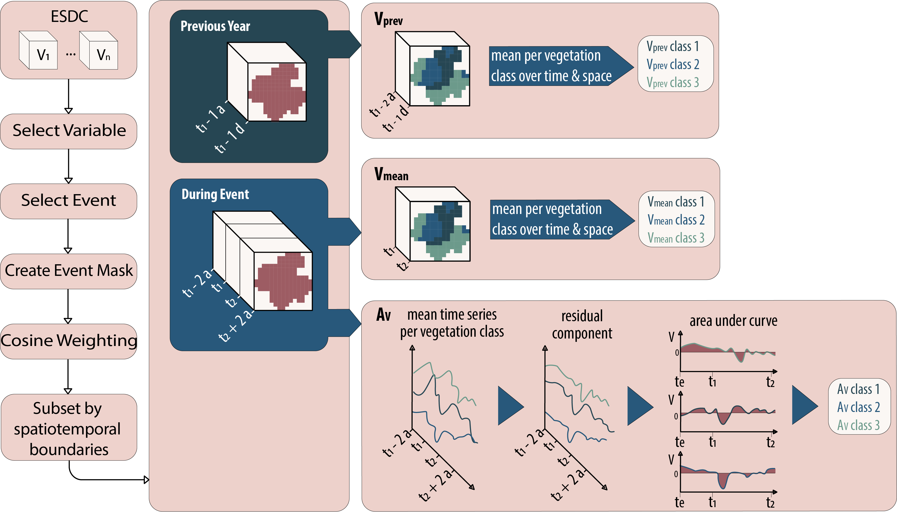

# Quantifying Vegetation Response to Compound Heat Wave and Drought Events

This repository contains the analysis workflow for my Master's thesis:

> **Quantifying vegetation response to compound heat wave and drought events and examining their drivers**

**Georg Brandt — Master's Thesis, Leipzig University, 2026**

The study investigates how different vegetation types respond to **compound heat wave and drought events (CHWDs)** at the global scale and examines which climatic and environmental conditions explain differences in vegetation response.

The analysis combines disturbance ecology, Earth observation data, time-series analysis, machine learning and explainable artificial intelligence.

---

## Overview

Climate change is expected to increase the frequency and duration of compound heat wave and drought events. These events can have substantial impacts on vegetation, but their effects can differ strongly between vegetation types and environmental conditions.

This study addresses two main questions:

1. **How do different vegetation types respond to compound heat wave and drought events?**
2. **Which environmental and climatic variables explain variability in vegetation response?**

To answer these questions, vegetation responses are quantified for **189 CHWDs occurring globally between 2002 and 2019**. Vegetation response is described using four metrics:

- **Resilience**
- **Resistance**
- **Recovery rate**
- **kNDVI anomaly**

The resulting event- and vegetation-specific observations are subsequently used to train XGBoost models. SHAP is then used to investigate the importance, direction and magnitude of the predictor variables.

---

## Scientific approach

The analysis follows a disturbance-ecological framework.

A vegetation time series is used to establish a pre-disturbance state and quantify how vegetation changes during and after a compound extreme event.

The four response metrics describe different aspects of the vegetation response:

| Metric | Description |
|---|---|
| **Resilience (Rl)** | The ability of vegetation to return towards its pre-disturbance state after the event |
| **Resistance (Rs)** | The magnitude of the vegetation response during the event |
| **Recovery (Rc)** | The direction and rate of vegetation development following maximum disturbance |
| **kNDVI anomaly (AkNDVI)** | The mean kNDVI anomaly during the event |

For resilience, resistance and recovery, a value close to **1** represents no substantial deviation from the corresponding reference state. For the kNDVI anomaly, a value close to **0** indicates little or no anomaly.

---

## Data

### Earth System Data Cube

The main environmental and vegetation data are obtained from the **Earth System Data Cube (ESDC)**.

The ESDC provides globally distributed Earth system variables on a common spatial and temporal grid. The dataset used in this study has:

- **0.25° spatial resolution**
- **8-day temporal resolution**

The following variables are used:

| Variable | Description |
|---|---|
| `kNDVI` | Kernel Normalized Difference Vegetation Index; proxy for vegetation health |
| `T2m` | 2 m mean air temperature |
| `P` | Precipitation |
| `RSM` | Root-zone soil moisture |
| `E` | Evaporation |
| `PE` | Potential evaporation |

The meteorological variables temperature and precipitation originate from ERA5. 

### Compound heat wave and drought events

CHWD events are obtained from **Dheed**, a spatiotemporal database of dry and hot extreme events based on ERA5 reanalysis data.

The study analyses 189 events occurring between **2002 and 2019**.

### Vegetation classification

Vegetation responses are aggregated according to land-cover / vegetation class.

The analysis therefore does not model individual plants or individual pixels as independent ecological units. Instead, the results describe vegetation response at a **regional/global scale for different vegetation classes**.

This aggregation was necessary given the computational scope of the study, but also reduces spatial variability in the resulting observations.

---

# How to use this repository

This repository contains two different components:

1. **Interactive analysis notebooks:** – used as a sandbox for exploring the data, testing individual analysis steps and getting familiar with the functions and workflow.
3. **analysis_execution.py:** – the main script used to execute the actual analysis for all selected compound heat wave and drought events.
4. **utils/:** contains the functions used by the analysis script

The notebooks are therefore **not required to reproduce the final analysis**. They document the development and exploration of individual analysis steps and provide an interactive way to understand how the different components of the workflow work.

For running the complete analysis, `analysis_execution.py` is the relevant entry point.

---

## Interactive notebooks

The numbered notebooks represent individual steps of the analysis workflow:

```text
1. Data exploration
        ↓
2. Data preprocessing
        ↓
3. Event aggregation
        ↓
4. Analysis
        ↓
5. Dimensionality reduction
        ↓
6. Modelling
```
Step 1 to 3 produce the predictor variables used for the analysis. This process is visualized in the following figure:

<p align="center">
  
</p>

<p align="center">
  <em>Creation of minicubes used for modeling.</em>
</p>

*This repository contains the computational workflow developed during my Master's thesis on vegetation responses to compound heat wave and drought events.*
